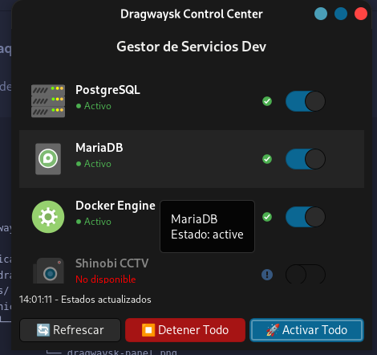

🚀 Dragwaysk Control Center
Gestor Gráfico de Servicios Systemd para Desarrolladores

📋 Descripción
Dragwaysk Control Center es una utilidad de escritorio ligera diseñada para sistemas Linux (Debian, Canaima, Ubuntu). Su objetivo principal es optimizar el tiempo de arranque del sistema operativo al permitir mantener servicios pesados (Bases de datos, Docker, NVR) desactivados por defecto, y encenderlos "a demanda" mediante una interfaz gráfica amigable.

Ya no necesitas recordar comandos largos de terminal ni desperdiciar RAM con servicios que no estás usando.

✨ Características Principales
⚡ Optimización de Arranque: Reduce el tiempo de carga del S.O. al evitar el inicio automático de servicios pesados.

🎛️ Interfaz Nativa GTK: Se integra visualmente con el entorno de escritorio GNOME/XFCE.

🔒 Seguridad: Utiliza pkexec (Polkit) para solicitar permisos de administrador de forma segura solo cuando es necesario.

🛠️ Modo Dev: Botón de un solo clic para levantar todo el entorno de desarrollo (DBs + Docker).

👁️ Feedback Visual: Los interruptores reflejan el estado real del servicio (systemctl is-active).

🔧 Requisitos del Sistema
Python 3.6+

Librerías GTK 3 (python3-gi, gir1.2-gtk-3.0)

Systemd

📦 Instalación
Opción A: Instalar paquete .DEB (Recomendado)
Si ya tienes el archivo .deb generado:

Bash

sudo dpkg -i dragwaysk-panel_1.0_all.deb
sudo apt-get install -f  # En caso de que falten dependencias
Una vez instalado, búscalo en el menú de aplicaciones como "Dragwaysk Control".

Opción B: Ejecutar desde el código fuente
Instalar dependencias:

Bash

sudo apt install python3-gi python3-gi-cairo gir1.2-gtk-3.0
Clonar o descargar el script.

Ejecutar:

Bash

python3 dragwaysk-panel.py
⚙️ Configuración y Personalización
Para agregar o quitar servicios del panel, no necesitas recompilar. Si instalaste el paquete .deb, edita directamente el archivo ejecutable:

Bash

sudo nano /usr/bin/dragwaysk-panel
Busca la variable SERVICES_CONFIG al inicio del archivo:

Python

SERVICES_CONFIG = [
    {"label": "PostgreSQL", "service": "postgresql", "icon": "server-database"},
    {"label": "MariaDB", "service": "mariadb", "icon": "drive-harddisk"},
    # Agrega tu nuevo servicio aquí:
    {"label": "Mi Nuevo Servicio", "service": "nombre-servicio", "icon": "applications-system"},
]
🏗️ Compilación (Empaquetado)
Si modificas el código fuente y quieres crear un nuevo instalador .deb:

Prepara la estructura de directorios:

Bash

mkdir -p paquete/DEBIAN paquete/usr/bin paquete/usr/share/applications
Copia el script y los archivos de control (ver estructura del proyecto).

Genera el paquete:

Bash

dpkg-deb --build paquete dragwaysk-panel_1.0_all.deb
📸 Capturas de Pantalla

**Características visibles:**
- ✅ Validación de servicios (Shinobi CCTV aparece como "No disponible")
- ✅ Indicadores visuales de estado con colores (verde=activo, gris=inactivo, rojo=no disponible)
- ✅ Tooltips informativos al pasar el mouse
- ✅ Tres botones de control: Refrescar, Detener Todo, Activar Todo
- ✅ Barra de estado en la parte inferior mostrando última actualización
- ✅ Notificaciones integradas para feedback de operaciones

📄 Licencia
Este proyecto es de uso personal y educativo. Siéntete libre de modificarlo para tus necesidades.